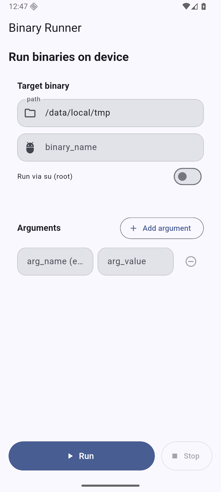

# Binary Runner (Android)

Single-screen Flutter app to run arbitrary binaries on an Android device.

## Android 16 (Baklava) Release
- Target: Android 16 / API 36 (Baklava)
- Emulator AVD: `baklavaApi36` (Google APIs, arm64-v8a)
- Built artifact: `build/app/outputs/flutter-apk/app-release.apk`

## Screenshots
Captured from the Android 16 emulator after launching the app:



## App Icon
This project includes a simple adaptive launcher icon.
- Background color: `#1E2A44`
- Foreground: vector triangle mark

Android resources added:
- `android/app/src/main/res/values/colors.xml`
- `android/app/src/main/res/drawable/ic_launcher_foreground.xml`
- `android/app/src/main/res/mipmap-anydpi-v26/ic_launcher.xml`

## UI
- path: directory that contains the binary (e.g. `/data/local/tmp`).
- binary_name: the executable filename (e.g. `mytool`).
- + button: add argument rows. Each row has optional `arg_name` and `arg_value`.
  - If `arg_name` provided, app sends `--arg_name` then value (if any).
  - If only value is provided, it's passed positionally.
- Run via su (root): toggle to execute with `su -c`.
- Run: executes `<path>/<binary_name>` with your args and shows stdout/stderr/exit code.

## Android specifics
- When "Run via su" is ON, the app runs `su -c "<cmd>"`. This requires a rooted device.
- Without su, the process must be executable and accessible by the app sandbox.

## Build and run
Use Flutter tooling as usual. Example:

```
flutter run -d <your_android_device_id>
```

## Notes
- Make sure your binary is built for the device architecture and has execute permissions (e.g. `chmod +x /data/local/tmp/mytool`).
- If execution fails, check stderr in the app for permission/SELinux denials.
